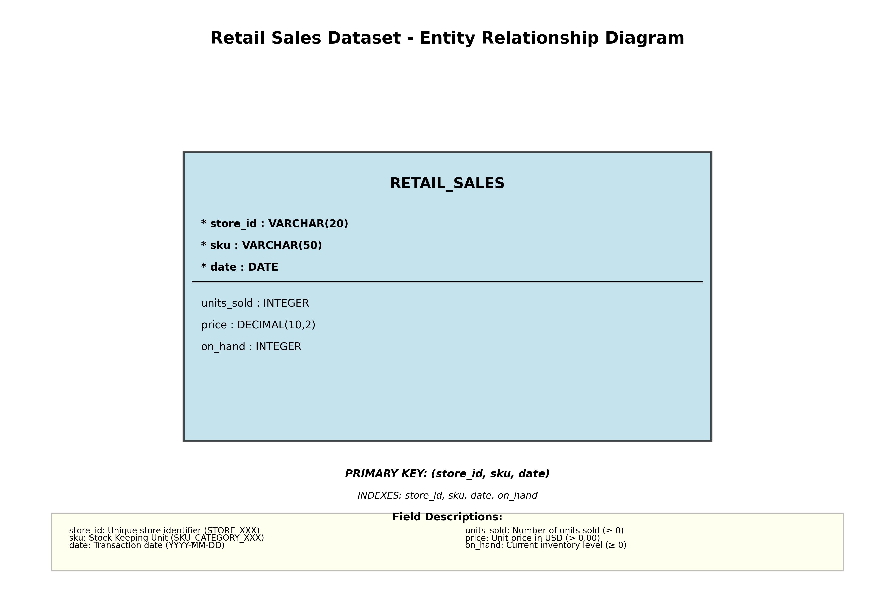

# Entity-Relationship Diagram for Retail Sales Dataset

This ER diagram represents the retail sales dataset's structure and relationships:

- `Retail Sales`: Captures daily sales transactions, inventory levels, and pricing information.
  - **Primary Key**: Combination of `store_id`, `sku`, and `date`. 
  - **Index**: Includes `store_id`, `sku`, `date`, and `on_hand` for optimized queries.

## Fields:

- **store_id**: A unique identifier for each retail store. `Format: STORE_XXX`
- **sku**: Stock Keeping Unit, representing unique product identifiers. `Format: SKU_CATEGORY_XXX`
- **date**: Represents the date of the sales transaction.
- **units_sold**: Number of product units sold on the specified date.
- **price**: The unit price of the product in USD.
- **on_hand**: The available inventory count in stock.

